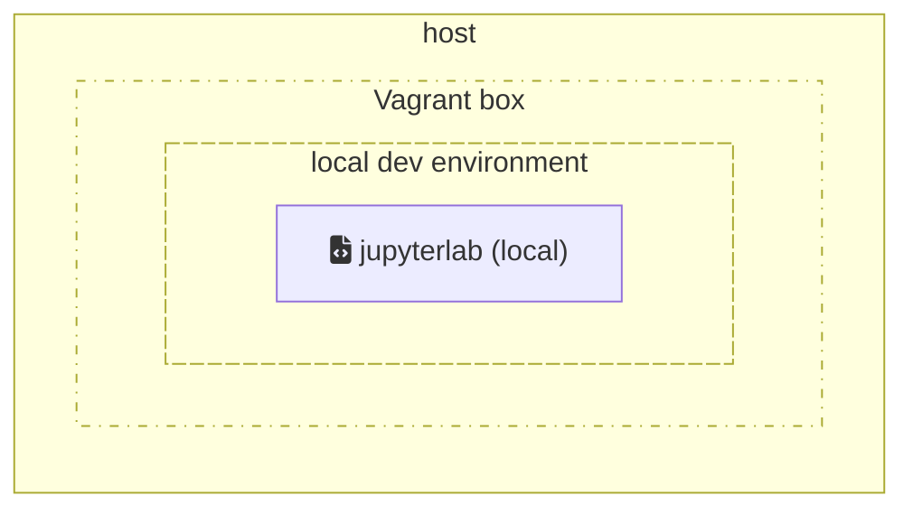
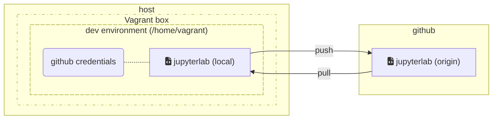
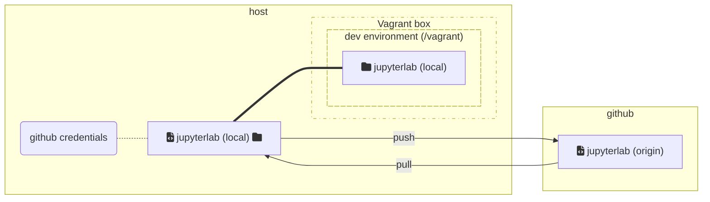

# jupyterlab-local-dev-with-vagrant

A tool to build local development environments for JupyterLab using Vagrant.

## Wiki

The wiki can be found here: https://github.com/markgreene74/jupyterlab-local-dev-with-vagrant/wiki

## TODO
- test on
  - Linux [X]
  - macOS [ ]
  - Windows [ ]

## Overview

The initial aim of this project was to investigate using Vagrant/Virtualbox to create, manage and run a local dev environment for Jupyterlab. See https://github.com/jupyterlab/jupyterlab/issues/12717 for more context.

At this stage the project is functional and running a local Jupyterlab dev environment in Vagrant is a valid alternative, however it is still missing a lot of documentation. 

## Requirements

- install Vagrant ([link](https://www.vagrantup.com/downloads))
- install VirtualBox ([link](https://www.virtualbox.org/wiki/Downloads))

*NOTE:* Vagrant is licensed under the MIT License ([see here](https://github.com/hashicorp/vagrant/blob/main/LICENSE)). The VirtualBox base package (source code and platform binaries) is licensed under the GNU General Public License v2 ([see here](https://www.virtualbox.org/wiki/Licensing_FAQ)). 

## Quickstart

- change the `GITHUB_USERNAME` in [`Vagrant-bootstrap-jupyterlab.sh`](Vagrant-bootstrap-jupyterlab.sh) if you wish to work on a fork

- (*OPTIONAL*) edit [`Vagrant-bootstrap.sh`](Vagrant-bootstrap.sh) to change the virtual machine specs (RAM, vCPU)

- run `vagrant up`

- (*OPTIONAL*) to capture the provisioning logs run `vagrant up 2>&1 | tee -a vagrant-up-$(date +%F).log` instead

- if successful the output should look like:
  ```
        jupyter-dev-environment: All done, the Jupyterlab local development environment is ready
    (...)
    ==> jupyter-dev-environment: This is a local dev environment for Jupyter based on Debian 11 (bullseye)
  ```

- login on the virtual machine with `vagrant ssh`

- run
  ```shell
  cd ~/jupyterlab
  jupyter lab --no-browser --ip 0.0.0.0 --dev-mode --watch
  ```

- copy and paste the link containing the token in your browser, the link should look like:
  ```
  http://127.0.0.1:8888/lab?token=bb4a1ca...
  ```

## Other useful commands

- stop the virtual machine
  ```shell
  vagrant halt
  ```

- remove the virtual machine
  (NOTE: this will completely delete the vm, which will be re-created and provisioned from scratch the next time `vagrant up` is executed)
  ```shell
  vagrant destroy
  ```

- check the virtual machine status
  ```shell
  vagrant status
  ```

- re-run the provisioning scripts
  ```shell
  vagrant up --provision
  ```

### Snapshots

The ability to take/restore snapshots can be very useful. For more information see: https://www.vagrantup.com/docs/cli/snapshot.

- list the available snapshots
  ```shell
  vagrant snapshot list
  ```

- save and restore, respectively, a snapshot without having to specify a name
  > Warning: If you are using push and pop, avoid using save and restore which are unsafe to mix.
  ```shell
  vagrant snapshot push
  ```
  ```shell
  vagrant snapshot pop
  ```

- save and restore, respectively, a specific snapshot
  ```shell
  vagrant snapshot save <SNAPSHOT_NAME>
  ```
  ```shell
  vagrant snapshot restore <SNAPSHOT_NAME>
  ```

## Advanced usage *(Work In Progress)*

*Here be dragons*

In this section we will discuss how Vagrant can be used as part of a more advanced workflow.

The diagram below shows the relationship between the different components: the _local dev environment_ run inside the _Vagrant box_, which in turn run inside the host. 



### Use your `git` credentials inside the virtual machine

By default, the bootstrap script will set up a local dev environment from a clone *inside* the Vagrant box.

In this scenario:
- `git` configuration and credentials need to be inside the Vagrant box
- it will be possible to `git push` changes upstream while logged in on the Vagrant box 



### Run `jupyterlab` in the shared `/vagrant` directory


In this scenario:
- there is no need to transfer `git` configuration and credentials inside the Vagrant box
- it will be possible to use `git` and follow your normal workflow on the *host* OS



## Troubleshooting

### The environment is too slow / is taking too long to build

The resources assigned to the Vagrant box are limited by default to 2 vCPU and 2 GB of memory.

It is possible to increase the resources by modifying the following lines in the [Vagrantfile](./Vagrantfile#L8-L9):

```
    v.memory = 2048  # CHANGEME if needed
    v.cpus = 2       # CHANGEME if needed
```

Restart the Vagrant box to make the changes effective:

```shell
vagrant halt && vagrant up
```
 
